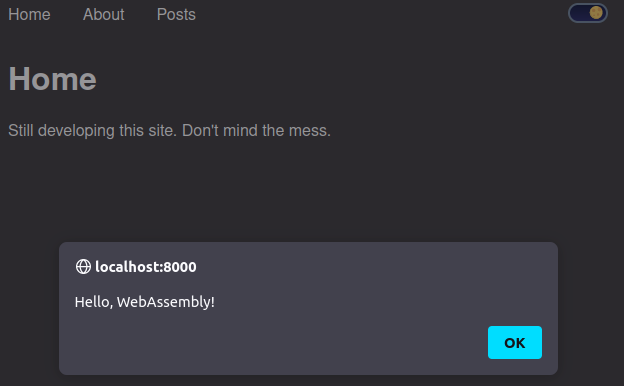

I spent all last night banging my head trying to get Gatsby to play well with
Rust and WASM, but to no avail. I was following a variety of different guides
and even got Gatsby to compile my Rust code into WASM, but couldn't get
JavaScript to properly import my WASM modules. I think my issue in following
these guides was I wouldn't have a deep understanding what I was actually doing.
I would add configuration upon configuration until I realize I'm lost within my
own forest. So I'm taking a step back and starting simple.

## Running WASM For The First Time

First, I had to change the source directory for Gatsby. I wanted the Rust
project to exist at the root and the source directory is same name as Gatsby's
default. Luckily, Gatsby is pretty configurable so it's a matter of pointing the
Gatsby filesystem plugins to the correct directory. So my Gatsby code will go in
`js/` and my Rust code will be in `src/`. After I finished configuring Gatsby,
all that was left for me to do was to do a `cargo init --lib`.

Following the [Mozilla WebAssembly
guide](https://developer.mozilla.org/en-US/docs/WebAssembly/Rust_to_wasm) I
replaced the default Rust code with the following:

```rust
// lib.rs

use wasm_bindgen::prelude::*;

#[wasm_bindgen]
extern {
    pub fn alert(s: &str);
}

#[wasm_bindgen]
pub fn greet(name: &str) {
    alert(&format!("Hello, {}!", name));
}
```

First, I'm importing `wasm_bindgen` which is a tool that helps us facilitates
high-level interactions between our JavaScript and Rust code using WASM as a
medium. Then I use the `#[wasm_bindgen]` annotations to signify which functions will
be ported to WASM modules. The `alert` function is placed in an `extern` block to
tell the compiler that `alert` is defined externally. The `greet` function will
be exported, not placed in an `extern` block, will be exported so that it can be
read by JavaScript code.

Then I add the following to `Cargo.toml`:

```toml
...

[lib]
crate-type = ["cdylib"]

[dependencies]
wasm-bindgen = "0.2"
```

This is actually all I need to produce a WASM module. All I have to do is run
`wasm-pack build --target web` and it'll produce a `pkg/` directory containing
all of my WASM modules.

Afterwards, my current directory structure looks something like this (I'm
omitting several files for brevity):
```
pkg/
├── package.json
├── README.md
├── weblog_bg.wasm
├── weblog_bg.wasm.d.ts
├── weblog.d.ts
└── weblog.js
js/
├── components
├── hooks
├── images
├── pages
│   ├── 404.js
│   ├── about.js
│   ├── index.js
│   ├── posts.js
│   └── todo.js
├── posts
├── styles
└── util
src/
Cargo.toml
```

Now, I'm just trying to get a proof of concept working, so I'm going to just
call the WASM modules directly from the entry point of my Gatsby site:

```javascript
// index.js

import React from 'react';
import Page from '../components/Page';

// Importing our WASM module
import init, { greet } from '../../pkg/weblog.js';
// Initializing the WASM module
init()
.then(() => {
  // Calling the WASM greet function
  greet("WebAssembly");
});

const IndexPage = () => {
  return (
    <Page pageTitle="Home">
      <p>Still developing this site. Don't mind the mess.</p>
    </Page>
  );
};

export default IndexPage;
```

After building Gatsby, the home page looks like this:



Even though this looks disgustingly meta, it shows my proof of concept works.

## Update

So currently I have Game of Life implemented following [this
guide](https://rustwasm.github.io/docs/book/game-of-life/implementing.html), but
I can't get my site to properly run the WASM module. As far as I can
tell, the code is correct. But for some reason, I'm getting an 'index out of
bounds' error. I think this might have to do with the generated JS files from
`wasm-pack`, though I'm not exactly sure why. But man, this bums me out.
